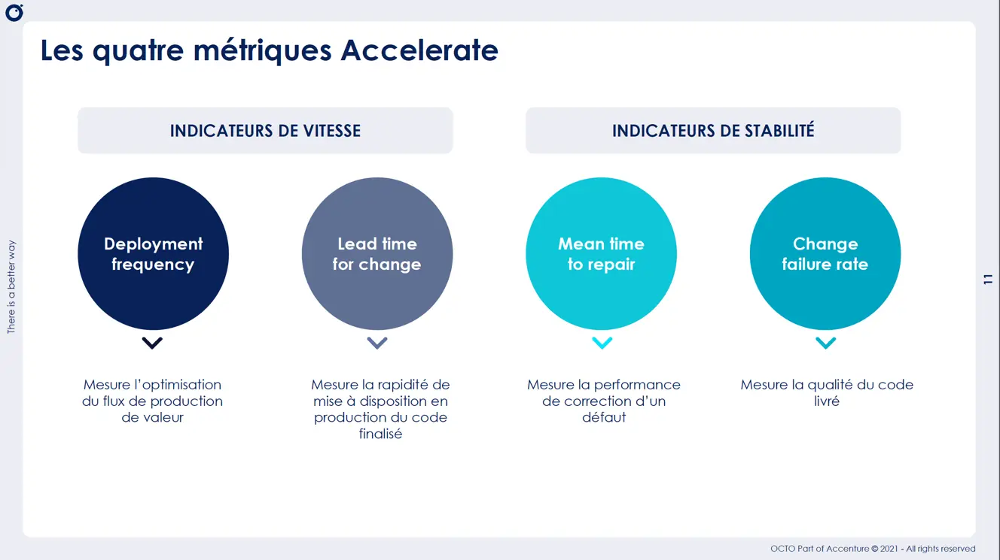
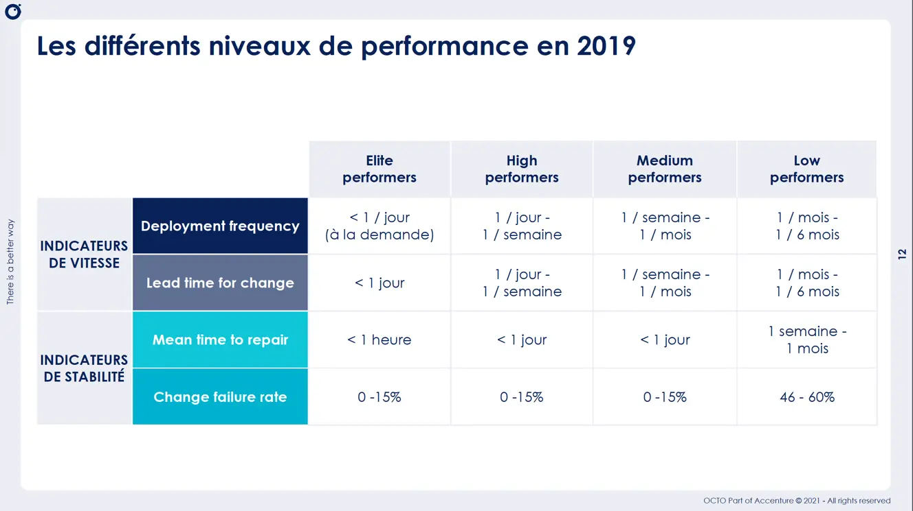
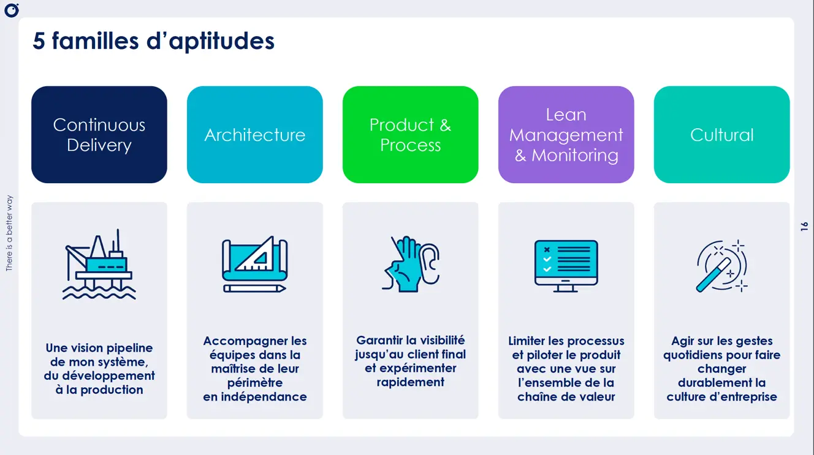
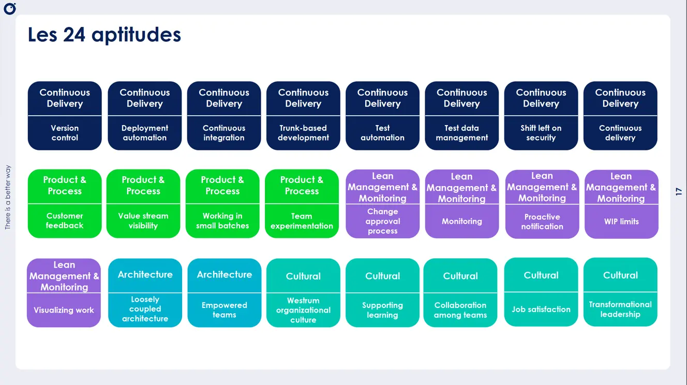
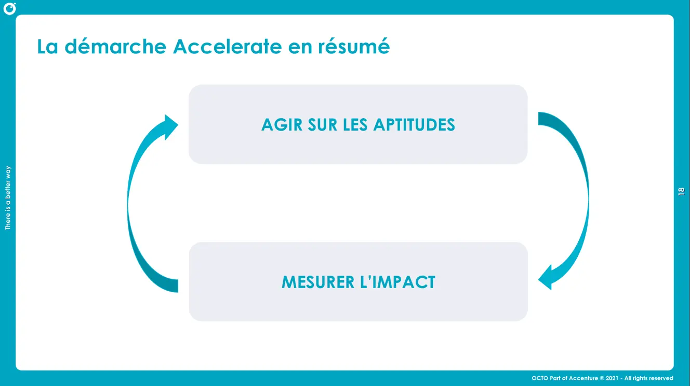

# Qualité logicielle Kesaco ?
## **1. Qu’est-ce que la qualité logicielle ? Comment la mesurer ? (Accelerate)**
### **Connect**
* "Ce qui m’énerve dans un logiciel"
  * Par groupes de 3 : lister 3 défauts qui rendent une app insupportable. 
  * Mise en commun : tu relies leurs exemples aux dimensions de la qualité (fiabilité, lenteur, bugs, incompréhensible…).
* Question éclair : *"Selon vous, comment mesure-t-on la qualité d’un logiciel dans une entreprise ?"*

### **Concepts**
* Micro-exposé interactif (10 min) :
    * Dimensions : lisibilité, maintenabilité, testabilité, fiabilité, performance.
    * Les 4 métriques Accelerate (DORA) en version vulgarisée.







### **Concrete Practice**
* Mini-réflexion individuelle :
  → “Note une chose que tu fais déjà qui contribue à la qualité.”
  → “Note une chose que tu pourrais essayer dès demain.”

---

## **2. Écrire du code lisible (Clean Code + charge cognitive)**
### **Connect**
* *"Qu’est-ce qui rend ce code difficile à comprendre ?"*

```php
<?php

declare(strict_types=1);

namespace GildedRose;

final class GildedRose
{
    /**
     * @param Item[] $items
     */
    public function __construct(
        private array $items
    ) {
    }

    public function updateQuality(): void
    {
        foreach ($this->items as $item) {
            if ($item->name != 'Aged Brie' and $item->name != 'Backstage passes to a TAFKAL80ETC concert') {
                if ($item->quality > 0) {
                    if ($item->name != 'Sulfuras, Hand of Ragnaros') {
                        $item->quality = $item->quality - 1;
                    }
                }
            } else {
                if ($item->quality < 50) {
                    $item->quality = $item->quality + 1;
                    if ($item->name == 'Backstage passes to a TAFKAL80ETC concert') {
                        if ($item->sellIn < 11) {
                            if ($item->quality < 50) {
                                $item->quality = $item->quality + 1;
                            }
                        }
                        if ($item->sellIn < 6) {
                            if ($item->quality < 50) {
                                $item->quality = $item->quality + 1;
                            }
                        }
                    }
                }
            }

            if ($item->name != 'Sulfuras, Hand of Ragnaros') {
                $item->sellIn = $item->sellIn - 1;
            }

            if ($item->sellIn < 0) {
                if ($item->name != 'Aged Brie') {
                    if ($item->name != 'Backstage passes to a TAFKAL80ETC concert') {
                        if ($item->quality > 0) {
                            if ($item->name != 'Sulfuras, Hand of Ragnaros') {
                                $item->quality = $item->quality - 1;
                            }
                        }
                    } else {
                        $item->quality = $item->quality - $item->quality;
                    }
                } else {
                    if ($item->quality < 50) {
                        $item->quality = $item->quality + 1;
                    }
                }
            }
        }
    }
}
```

### **Concepts**
Slides [Clean Code](clean-code/Clean-code.pptx)

### **Concrete Practice**
* Atelier de refactoring express (15 min) : `Food` 
* Partage en groupe : 2–3 binômes projettent leur résultat.

> Et si on appliquait ces principes collectivement sur l'un de vos repos ?

### **Conclusion**
“Sur une échelle de 1 à 5, en quoi ton / votre code est plus lisible maintenant ? Pourquoi ? ”

## 3. Et la charge cognitive dans tout ça ?
On va parler cerveau [ici](clean-code/Clean%20Code%20du%20point%20de%20vue%20de%20la%20cognition.pptx)

# **4. Linters**
## **Connect**
Web Hunt : 
- Qu'est-ce qu'un `Linter` ?
- Qu'est-ce que l'analyse static de code ?

## **Concepts*
* Explication interactive :
    * Pourquoi c’est utile dans une équipe ?
    * Différence entre linter & formatter
* Demo `SonarCloud` [ici](https://sonarcloud.io/project/overview?id=ythirion_jurassic-code)

## **Concrete practice**
- Jour 7 du calendrier de l'Avent [ici](https://coda-school.github.io/advent-2025/?day=07).
- Tester [`phpstan`](https://phpstan.org/) / [`SonarQube for IDE`](https://www.sonarsource.com/products/sonarqube/ide/)

## **Conclusion**
* Retour individuel :
  → “Quelle règle du linter trouves-tu la plus utile et pourquoi ?”

---

## **5. Pyramide de tests : pourquoi et comment tester ?**
### **Connect**
* Activité :
  → “Raconte un bug que tu as déjà créé (même petit).”
  → Mise en lien : beaucoup de bugs = manque de tests.

## **Concepts**
* Courte explication :
    * But d’un test
    * Test unitaire vs intégration vs E2E
    * La pyramide de tests
    * Notion AAA (Arrange–Act–Assert)

## **Concrete Practice**
* Atelier “Mon premier test automatisé”

* Bonus : faire échouer volontairement un test → ils voient l’intérêt immédiat.

## **Conclusion**
* Question finale :
  → “Quel type de test a le plus de valeur à ton niveau actuel ? Pourquoi ?”

---
